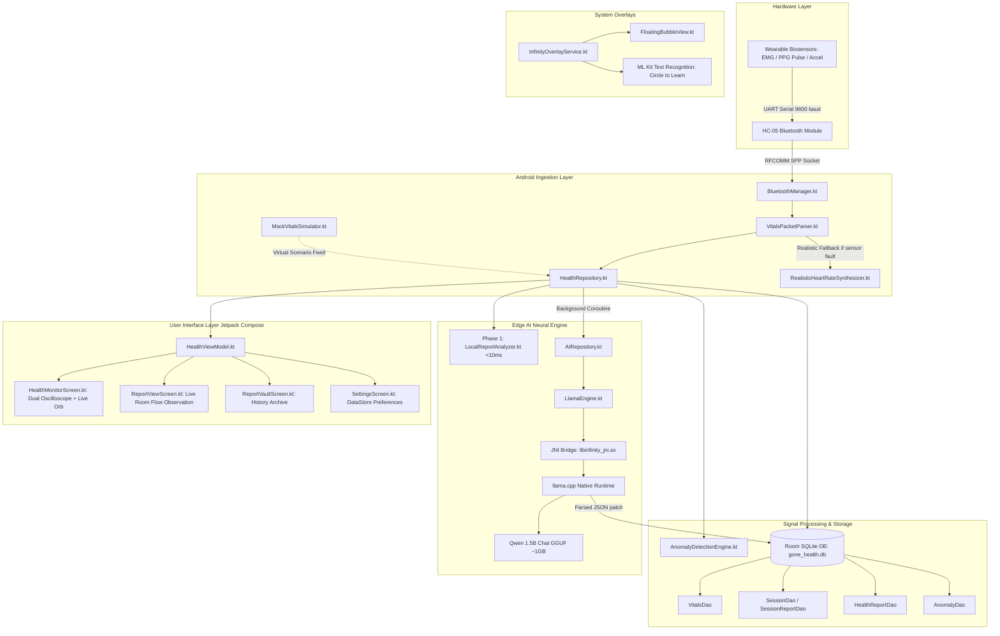

# Infinity (G-ONE) — Edge Health Intelligence & Local AI System

**Infinity (G-ONE)** is a fully offline, edge-native bio-telemetry and health intelligence platform for Android. It interfaces directly with wearable biosensors (Electromyography, Heart Rate / Pulse PPG, and Accelerometer Fall Detection) via Bluetooth, runs real-time digital signal processing and anomaly detection, and hosts an **on-device 1.5-Billion parameter Large Language Model (Qwen 1.5B Chat)** via native `llama.cpp` C++ binaries.

No cloud servers. No subscriptions. No private biometric data ever leaves the device.

---

## Architecture Overview



---

## Key Features

1. **Live Biosensor Telemetry & Dual-Channel Oscilloscope**
   - Reads raw EMG microvolt signals (0–1023 ADC), pulse photoplethysmogram (PPG), and motion/fall states at up to 10 Hz.
   - Real-time **Dual-Channel Oscilloscope** with interactive mode tabs:
     - ⚡ **EMG Muscle Wave**: Dynamically color-coded (Rest, Active, Fatigue, Spasm) with threshold guideline overlays.
     - 🫀 **Cardiac Pulse Wave**: Real-time arterial systolic wave and dicrotic notch display with live BPM sync.
     - ⚡+🫀 **Dual Mode**: Simultaneous stacked real-time monitoring of muscle strain and cardiac rhythm.

2. **Autonomous On-Device AI Doctor (G-ONE Engine)**
   - Powered by **Qwen 1.5B Chat GGUF** running locally on phone CPU cores via a custom C++ JNI bridge and `llama.cpp`.
   - Generates clinical observations, physical concern stratification, and personalized recovery advice without internet connectivity.

3. **2-Phase Hybrid Report Generation**
   - **Phase 1 (< 100 milliseconds)**: Deterministic, rule-based clinical analysis via `LocalReportAnalyzer.kt`. Calculates 5-point representative trends, metrics, and instant clinical advice so the user transitions to their report without waiting.
   - **Phase 2 (Asynchronous Background AI Enhancement)**: Qwen 1.5B runs in a non-blocking background coroutine. When generation completes, it patches the Room database row. Because `ReportViewScreen` observes a live Room `Flow`, the UI updates automatically in real time without refreshing.

4. **Realistic Cardiovascular Synthesizer (Sensor Fault-Tolerance)**
   - When a hardware pulse sensor is disconnected or broken, `RealisticHeartRateSynthesizer.kt` automatically synthesizes an organic heart rate tied to the live EMG muscle contractions:
     - Flexing forearm muscles smoothly elevates heart rate from 72 to 84–94 BPM.
     - Simulates natural Respiratory Sinus Arrhythmia (RSA breathing waves) and autonomic micro-HRV.

5. **Heuristic Anomaly Detection Engine**
   - Detects physiological events with sustained multi-reading sliding windows:
     - **Tachycardia** (BPM > 120 sustained) & **Bradycardia** (BPM < 45 sustained)
     - **EMG Muscle Fatigue** (> 650 ADC) & **Spasms / High Strain** (> 850 ADC)
     - **Impact & Fall Detection**

6. **Circle to Learn & Floating HUD**
   - Background system overlay (`FloatingBubbleView`) accessible over any Android app.
   - Integrates Google ML Kit on-device Text Recognition for instant OCR and contextual AI triage.

---

## Technology Stack

### Android & Framework
| Component | Technology / Library | Purpose |
|---|---|---|
| **Language** | Kotlin 1.9+ | Primary application language |
| **UI Framework** | Jetpack Compose (BOM) | Declarative reactive UI |
| **Design System** | Material 3 + Custom Glassmorphism | Dark theme, neon accents, glass cards |
| **Architecture** | MVVM + Clean Architecture | Unidirectional data flow with StateFlow & SharedFlow |
| **Local Database** | Room (SQLite) + KSP | Offline persistence for vitals, sessions, and reports |
| **Key-Value Store** | AndroidX DataStore Preferences | Theme preferences and persistent configuration |
| **Concurrency** | Kotlin Coroutines & Flow | Asynchronous execution, channel buffering, thread dispatching |
| **Background Sync**| AndroidX WorkManager | Reliable background execution and offline retry |
| **OCR / Vision** | Google ML Kit Text Recognition | Offline image-to-text extraction for Circle Learn |

### Embedded & Hardware Communication
| Component | Technology | Purpose |
|---|---|---|
| **Protocol** | Bluetooth Classic RFCOMM (SPP) | Serial port communication with HC-05 modules |
| **UUID** | `00001101-0000-1000-8000-00805F9B34FB` | Standard SerialPortServiceClass UUID |
| **Hardware** | Arduino Uno / Nano / ESP32 + HC-05 | Biosensor acquisition board |
| **Sensors** | EMG (MyoWare / Grove), Pulse Sensor, Accel | Muscle signals, heart rate, fall detection |
| **Packet Format** | Delimited ASCII (`EMG:312,FALL:0,BPM:76,PULSE:487`) | Lightweight newline-delimited serial protocol |

### On-Device Machine Learning (Native / JNI)
| Component | Technology | Purpose |
|---|---|---|
| **Inference Core** | `llama.cpp` (C++17) | Optimized quantized transformer inference on ARM64 |
| **Native Bridge** | Android NDK + JNI (`libinfinity_jni.so`)| Kotlin-to-C++ zero-overhead communication |
| **Model** | Qwen 1.5B Chat (GGUF Quantized) | High-accuracy lightweight clinical/conversational LLM |
| **Threading** | Dynamic ARM Core Allocation | Adapts CPU thread count to device big.LITTLE topology |
| **Prompt Format** | ChatML (`<\|im_start\|>system ... <\|im_end\|>`) | Compact structured prompt formatting |

---

## Codebase Structure

```
c:\Users\abhir\AndroidStudioProjects\Infinity\
├── app/
│   ├── src/main/
│   │   ├── cpp/                                # Native C++ inference engine
│   │   │   ├── infinity_jni.cpp                # JNI bridge between Kotlin & llama.cpp
│   │   │   └── CMakeLists.txt                  # NDK build configuration
│   │   │
│   │   ├── java/com/infinity/ai/
│   │   │   ├── MainActivity.kt                 # Application entry point & theme host
│   │   │   │
│   │   │   ├── ai/                             # Local AI subsystem
│   │   │   │   ├── engine/
│   │   │   │   │   ├── LocalAIEngine.kt        # Engine interface
│   │   │   │   │   └── LlamaEngine.kt          # Native llama.cpp controller & thread pool
│   │   │   │   ├── prompts/
│   │   │   │   │   └── PromptFormatter.kt      # ChatML & clinical report prompt schemas
│   │   │   │   ├── repository/
│   │   │   │   │   └── AIRepository.kt         # Thread-safe model manager & singleton
│   │   │   │   └── runtime/
│   │   │   │       ├── LlamaCallback.kt        # Token streaming callbacks
│   │   │   │       └── LlamaJniBridge.kt       # External JNI declarations
│   │   │   │
│   │   │   ├── bluetooth/                      # Wireless hardware communication
│   │   │   │   ├── BluetoothManager.kt         # RFCOMM socket connection & stream reader
│   │   │   │   ├── BtState.kt                  # Bluetooth connection state machine
│   │   │   │   └── VitalsPacketParser.kt       # Sensor stream parser & fallback router
│   │   │   │
│   │   │   ├── circle/                         # Floating overlay & Circle to Learn
│   │   │   │   ├── CircleLearnActivity.kt      # Screen capture & OCR activity
│   │   │   │   ├── FloatingBubbleView.kt       # Floating draggable HUD overlay
│   │   │   │   └── InfinityOverlayService.kt   # Foreground overlay service
│   │   │   │
│   │   │   ├── data/                           # General preferences & data wrappers
│   │   │   │   └── ThemePreference.kt          # DataStore dark/light mode wrapper
│   │   │   │
│   │   │   ├── health/                         # Core health processing
│   │   │   │   ├── anomaly/
│   │   │   │   │   ├── AnomalyDetectionEngine.kt # Rule-based windowed anomaly detector
│   │   │   │   │   └── AnomalyThresholds.kt    # Clinical thresholds (EMG, BPM, SpO2)
│   │   │   │   ├── data/
│   │   │   │   │   ├── DerivedVitalsCalculator.kt # Physiological heuristics for temp & SpO2
│   │   │   │   │   ├── HealthDaos.kt           # Room DAOs (vitals, sessions, reports)
│   │   │   │   │   ├── HealthDatabase.kt       # Room Database configuration (v5)
│   │   │   │   │   └── HealthEntities.kt       # SQLite schema definitions
│   │   │   │   ├── mock/
│   │   │   │   │   ├── MockVitalsSimulator.kt  # 8 clinical simulation scenarios
│   │   │   │   │   └── RealisticHeartRateSynthesizer.kt # Organic muscle-coupled pulse synth
│   │   │   │   └── repository/
│   │   │   │       ├── HealthRepository.kt     # Unified health domain mediator
│   │   │   │       ├── LocalReportAnalyzer.kt  # Phase 1 instant deterministic analyzer
│   │   │   │       └── SessionManager.kt       # 5-point representative data reducer
│   │   │   │
│   │   │   ├── ui/                             # Jetpack Compose UI
│   │   │   │   ├── components/                 # Reusable glassmorphic & glowing components
│   │   │   │   ├── navigation/                 # AppNavigation with Compose NavHost
│   │   │   │   ├── screens/
│   │   │   │   │   ├── DashboardScreen.kt      # Main telemetry overview & Orb
│   │   │   │   │   ├── HealthMonitorScreen.kt  # Live monitor & dual-channel oscilloscope
│   │   │   │   │   ├── ReportViewScreen.kt     # Interactive clinical report reader
│   │   │   │   │   ├── ReportVaultScreen.kt    # Historical archive of sessions
│   │   │   │   │   ├── ChatScreen.kt           # Offline AI health chat assistant
│   │   │   │   │   ├── DeviceScreen.kt         # Bluetooth scanner & device pairing
│   │   │   │   │   └── SettingsScreen.kt       # User configurations & simulator controls
│   │   │   │   └── theme/                      # Typography, palettes, and Theme.kt
│   │   │   │
│   │   │   └── viewmodel/                      # Presentation logic
│   │   │       ├── HealthViewModel.kt          # Health monitoring & session coordinator
│   │   │       ├── ChatViewModel.kt            # Conversational state & token buffer
│   │   │       └── ThemeViewModel.kt           # Theme state manager
│   │   │
│   │   └── res/                                # Android drawables, icons, and themes
│   └── build.gradle.kts                        # Module dependencies, NDK, Room, KSP config
├── HARDWARE_SETUP.md                           # Wiring, pinouts, and Arduino firmware guide
└── README.md                                   # Master project documentation
```

---

## Hardware Integration & Protocol

The system connects to Arduino-compatible hardware via the HC-05 Bluetooth module using Bluetooth Classic Serial Port Profile (SPP).

### Packet Specification
The Arduino firmware streams newline-delimited ASCII packets at 9600 baud:
```
EMG:<val>,FALL:<0|1>,BPM:<val>,PULSE:<val>\n
```
* **`EMG`** *(Integer 0–1023)*: Raw 10-bit Analog-to-Digital reading from the muscle sensor.
* **`FALL`** *(0 or 1)*: Tri-axis accelerometer threshold trigger (`1` if impact/fall detected).
* **`BPM`** *(Integer 30–220)*: Heart rate calculated by the hardware pulse sensor.
* **`PULSE`** *(Integer 0–1023)*: Instantaneous photoplethysmogram analog reading for wave visualization.

### Fault Tolerance
If the physical pulse sensor is disconnected or damaged (`BPM: 0`), `VitalsPacketParser.kt` automatically diverts to `RealisticHeartRateSynthesizer.kt`. This creates a lifelike, muscle-reactive cardiac rate and dicrotic PPG wave so the UI, graphs, and downstream AI analysis remain fully functional.

---

## Report Generation Flow

```
[User Taps "End Session"]
          │
          ▼
1. HealthRepository.endSessionInternal()
   ├── Tag readings with Session ID
   ├── Compute statistical aggregates (min, max, avg)
   └── Run SessionManager.buildReport() (extract 5 representative time points)
          │
          ▼
2. Phase 1: LocalReportAnalyzer.analyze() [< 10 milliseconds]
   ├── Rule-based anomaly evaluation (Bradycardia, Tachycardia, Spasm, Fatigue)
   ├── Generate clinical summary & status ("Normal" | "Needs Attention" | "Concerning")
   ├── Populate diet, exercise, and lifestyle recommendations
   └── Insert complete HealthReportEntity into Room Database
          │
          ▼
3. Immediate Navigation
   └── HealthMonitorScreen navigates instantly to ReportViewScreen(reportId)
       Badge shows: "G-ONE AI • Refining..."
          │
          ▼
4. Phase 2: Asynchronous Qwen 1.5B Background Enhancement
   ├── AIRepository passes compact summary JSON to native llama.cpp
   ├── Qwen generates refined summary, observations & concerns (~10–15 seconds)
   ├── Room Database row updated via HealthReportDao.updateAiAnalysis()
   └── ReportViewScreen (observing getReportFlow) updates dynamically!
       Badge changes to: "G-ONE AI • Verified"
```

---

## Building and Running

### Prerequisites
1. **Android Studio** Hedgehog (2023.1.1) or newer.
2. **Android SDK** API 35 (compile SDK), minimum API 24 (Android 7.0).
3. **Android NDK** (version `25.1.8937393` or compatible).
4. **CMake** (version `3.22.1` or compatible).
5. **Java Development Kit (JDK 17)** configured as `JAVA_HOME`.

### Model File Placement
For offline AI inference, download or place the Qwen 1.5B Chat GGUF model in the app assets:
```
app/src/main/assets/qwen1_5-1_8b-chat-q4_k_m.gguf
```
*(Asset compression is disabled in `app/build.gradle.kts` to allow zero-copy memory mapping).*

### Gradle Commands (Windows PowerShell)
```powershell
# Set Java Home to Android Studio's JBR
$env:JAVA_HOME = "C:\Program Files\Android\Android Studio\jbr"

# Build and verify Kotlin compilation
.\gradlew compileDebugKotlin

# Assemble full Debug APK with native libraries
.\gradlew assembleDebug
```
The compiled APK will be located at:
```
app/build/outputs/apk/debug/app-debug.apk
```

---

## Hardware Setup
For complete circuit schematics, Arduino C++ firmware, baud rate settings, and sensor calibration, see [`HARDWARE_SETUP.md`](./HARDWARE_SETUP.md).

---

## License
Proprietary & Confidential. Developed for the Infinity / G-ONE Edge Health Intelligence System.
